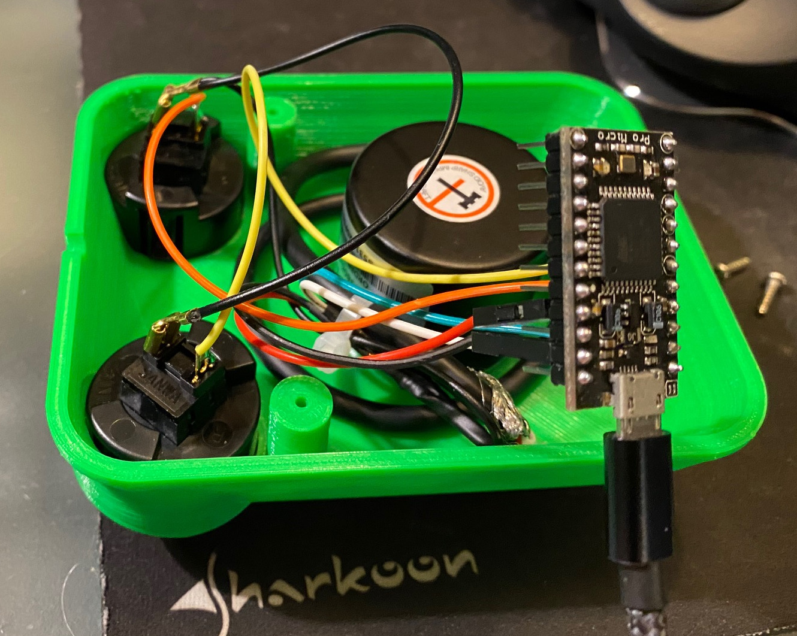

# Let's build an USB spinner controller


A spinner is a game controller with a wheel and buttons, where the wheel is
typically used to control the movement of the player object. In contrast to the
similar [paddle
controller](https://en.wikipedia.org/wiki/Paddle_%28game_controller%29), a
spinner uses typically a [rotary
encoder](https://en.wikipedia.org/wiki/Rotary_encoder), reporting relative
positions, instead of a potentiometer, which delivers absolute values.


<!-- vim-markdown-toc GFM -->

* [Parts](#parts)
* [Build and Run](#build-and-run)
    * [Circuit](#circuit)
    * [The case](#the-case)
    * [Firmware](#firmware)
        * [Dependencies](#dependencies)
    * [Run it](#run-it)
* [Unbricking an Arduino Pro Micro](#unbricking-an-arduino-pro-micro)
* [See also](#see-also)
* [Todo](#todo)
* [Author and License](#author-and-license)

<!-- vim-markdown-toc -->

This spinner controller uses an Arduino Pro Micro and announces itself as an
USB mouse when connected to a host. No additional drivers are needed, runs on
Linux, Mac and Windows. The Arduino Pro Micro was chosen because of his ability
to act as an USB device out of the box.

## Parts

* Rotary encoder LPD3806 600BM
* 2 SANWA OBS-30 buttons
* Arduino Pro Micro operating at 5V
* USB cable
* 3D-printed case and parts
* screws for the encoder (M3x15) and the case

## Build and Run

### Circuit

The circuit is very simple. Encoder and buttons are directly connected to the
Arduino Pro Micro. I did not use additional capacitors on the encoder, since
these cause problems on fast movements.


### The case

The case is [3D-printed](https://github.com/jandelgado/geeetech-i3-a-pro). I
used this model https://www.thingiverse.com/thing:3273180 from Thingiverse.


To attach the rotary encoder to the case, I printed [another part](case/) (had
no time to modify the original model): 

Finally, the knob of this https://www.thingiverse.com/thing:1667604 model 
is used.


This is after everything is connected and wired up:



### Firmware

This project uses [platformio](https://platformio.org) (but should also compile with
the Arduino IDE without problems). The firmware is located in the
[firmware](firmware/) directory. 

* To build the firmware run `make` 
* To flash the firmware run `make upload`

#### Dependencies

* https://github.com/arduino-libraries/Mouse
* https://github.com/madleech/Button
* https://github.com/PaulStoffregen/Encoder

### Run it

After the pro micro is flashed, it should announce itself as an USB mouse
device (Linux example):

```
[ 7007.507696] input: SparkFun SparkFun Pro Micro as
/devices/pci0000:00/0000:00:14.0/usb1/1-2/1-2:1.2/0003:1B4F:9206.000C/input/input34
[ 7007.508133] hid-generic 0003:1B4F:9206.000C: input,hidraw2: USB HID v1.01
Mouse [SparkFun SparkFun Pro Micro] on usb-0000:00:14.0-2/input2
```

Moving the paddle should move the mouse cursor horizontally on the screen. The
buttons are mapped to the left and right mouse button.

## Unbricking an Arduino Pro Micro

In case you bricked your Pro Micro, follow these instructions to re-animate
the boot loader again:  https://learn.sparkfun.com/tutorials/pro-micro--fio-v3-hookup-guide/all#ts-revive

## See also

* https://www.arduino.cc/reference/en/language/functions/usb/mouse/
* https://www.instructables.com/Atari-Like-USB-Paddle-Using-Arduino-Leonardo/
* https://www.thingiverse.com/thing:1667604
* https://www.thingiverse.com/thing:3745009

## Todo

[ ] make configurable at runtime (e.g. Sensitivity, orientation)

## Author and License

(C) Copyright 2020 by Jan Delgado. License: MIT.

